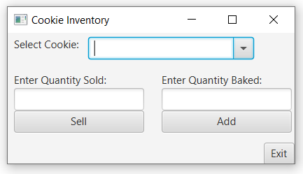
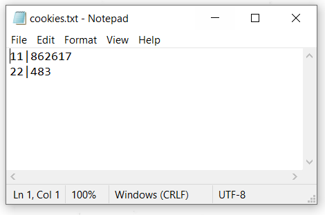

# Cookie-Inventory
A Cookie-Inventory Management Software
- Add, update cookie inventory in a txt file

Technologies: Java, JavaFX

Functions:

1/ Home

1.1a/ Home-Add (Cookie Name input Validation) 

1.1b/ Home-Add (Cookie Quantity input Validation)

// Same for the sell validation (1.2a, 1.2b)

1.2c/* Home-Sell (Cookie Quantity Validation from database) 

// Not enough cookies to sell

1.3/ Home-Exit

2/ TXT File (input/output data)

